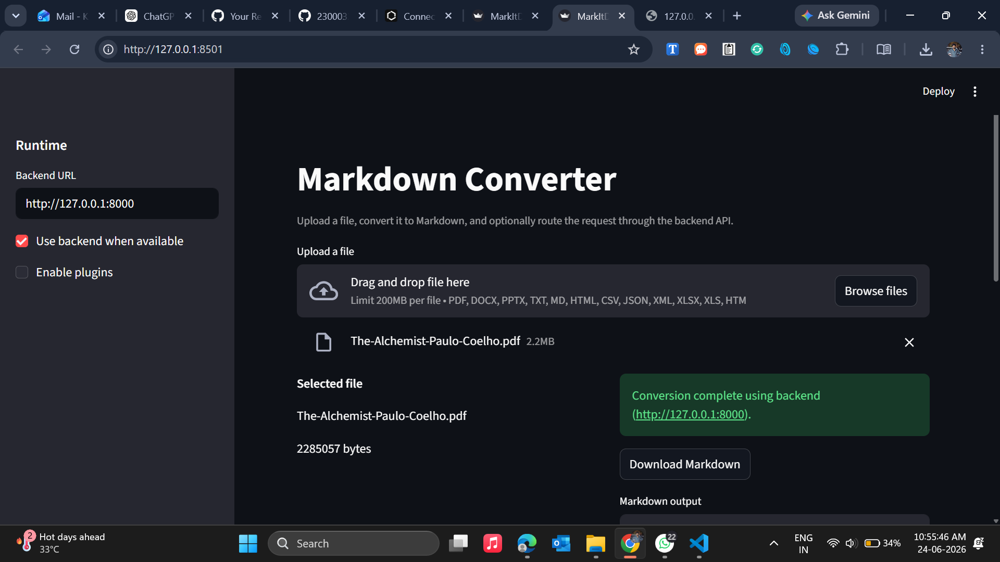

<<<<<<< HEAD
# Markdown Converter

A Streamlit-based Markdown Converter that converts PDF, DOCX, PPTX, TXT, HTML, CSV, JSON, XML, XLSX, XLS, and Markdown files into Markdown format.

## Features

* Convert multiple file formats to Markdown
* Streamlit web interface
* FastAPI backend support
* Download generated Markdown files
* Optional backend processing mode

## Application Preview



---

## Run the Backend

Open a terminal and run:

```bash
cd /d "c:/Clone Files/Markdown/markitdown"
python -m uvicorn backend:app --host 127.0.0.1 --port 8000
```

The backend API will be available at:

```text
http://127.0.0.1:8000
```

---

## Run the Streamlit Frontend

Open another terminal and run:

```bash
cd /d "c:/Clone Files/Markdown/markitdown"
streamlit run app.py --server.address 127.0.0.1 --server.port 8501
```

The application will be available at:

```text
http://127.0.0.1:8501
```

---

## Usage

1. Start the FastAPI backend.
2. Start the Streamlit application.
3. Upload a supported file.
4. Convert the file to Markdown.
5. Download the generated Markdown file.

## Supported Formats

* PDF
* DOCX
* PPTX
* TXT
* MD
* HTML / HTM
* CSV
* JSON
* XML
* XLSX
* XLS

```
```
=======
# Markdown Converter

A Streamlit-based Markdown Converter that converts PDF, DOCX, PPTX, TXT, HTML, CSV, JSON, XML, XLSX, XLS, and Markdown files into Markdown format.

## Features

* Convert multiple file formats to Markdown
* Streamlit web interface
* FastAPI backend support
* Download generated Markdown files
* Optional backend processing mode

## Application Preview


---

## Run the Backend

Open a terminal and run:

```bash
cd /d "c:/Clone Files/Markdown/markitdown"
python -m uvicorn backend:app --host 127.0.0.1 --port 8000
```

The backend API will be available at:

```text
http://127.0.0.1:8000
```

---

## Run the Streamlit Frontend

Open another terminal and run:

```bash
cd /d "c:/Clone Files/Markdown/markitdown"
streamlit run app.py --server.address 127.0.0.1 --server.port 8501
```

The application will be available at:

```text
http://127.0.0.1:8501
```

---

## Usage

1. Start the FastAPI backend.
2. Start the Streamlit application.
3. Upload a supported file.
4. Convert the file to Markdown.
5. Download the generated Markdown file.

## Supported Formats

* PDF
* DOCX
* PPTX
* TXT
* MD
* HTML / HTM
* CSV
* JSON
* XML
* XLSX
* XLS

```
```
>>>>>>> 4743881 (Add README screenshot)
